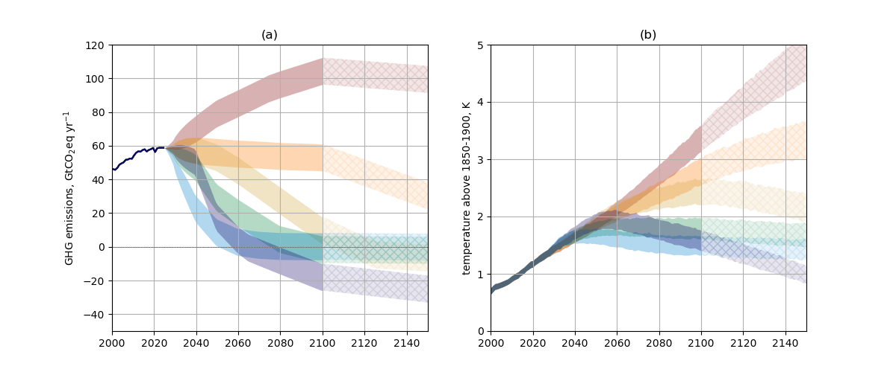

# cmip7-scenariomip
Indicative emissions and warming scenarios for CMIP7 ScenarioMIP.

Using stylised emissions pathways, we create a range of indicative global mean surface temperature projections for the CMIP7 ScenarioMIP proposed pathways using the [FAIR](https://github.com/OMS-NetZero/FAIR) (v2.2.0) simple climate model.

The final CMIP7 ScenarioMIP emissions pathways will be developed by integrated assessment modelling teams and climate simulations run by Earth System models. Therefore we expect that neither the emissions nor climate responses will exactly follow the pathways set out in this figure.

## how to reproduce
1. clone the repository
2. install the environment with `conda env create -f environment.yml`
3. activate environment `conda activate cmip7-scenariomip`
4. run `nbstripout --install` to commit clean notebooks
5. run `jupyter notebook`
6. navigate to the `notebooks` directory and run `scenarios.ipynb`